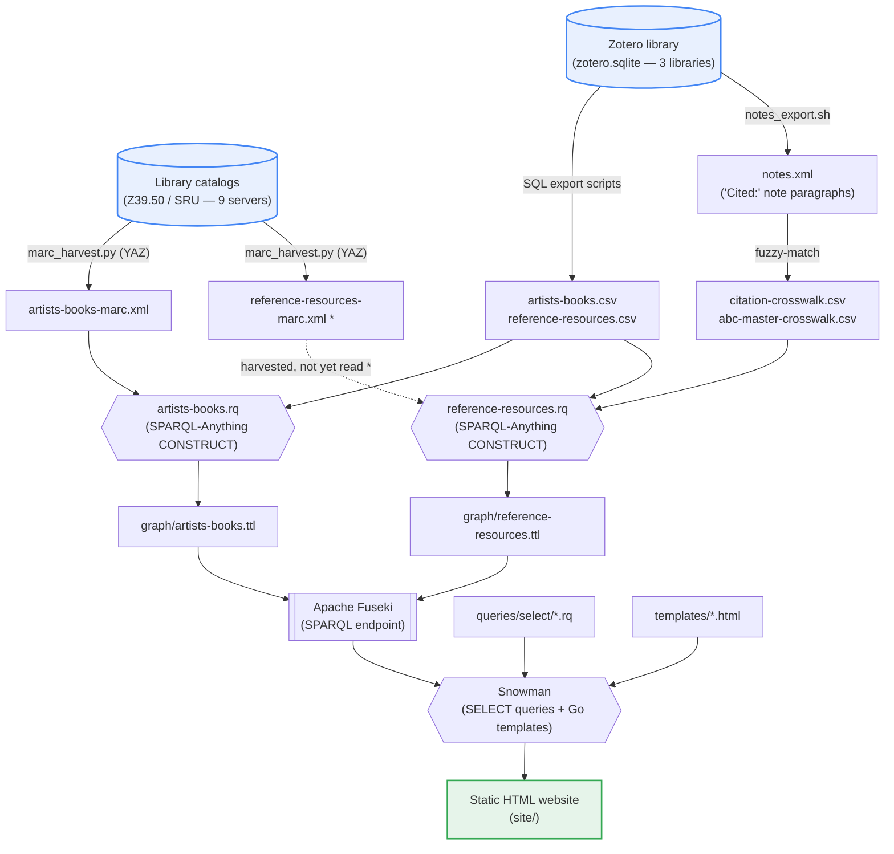

# Build pipeline

The build runs as two parallel tracks — the **artists' books** and the **reference works** that cite them — that meet at the RDF graph stage and flow into a single static website. See [`README.md`](README.md) for prose and [`CLAUDE.md`](CLAUDE.md) for operational detail.

`*` `reference-resources-marc.xml` is harvested but not yet consumed by a construct
query — the reference graph is currently built from the CSV plus the crosswalks
(tracked in #40 / #46 / #51).
