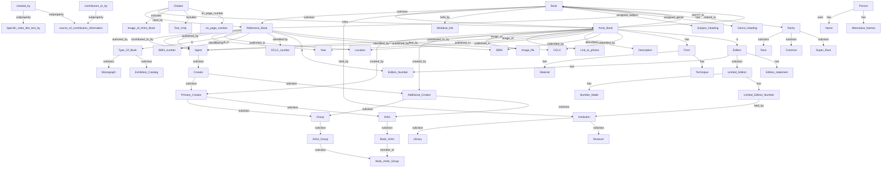

```mermaid
flowchart TD
Book -->|subclass| Reference_Book
Reference_Book -->|authored_by|Agent
Reference_Book -->|contributed_to_by|Agent
Reference_Book -->|published_by|Agent    
Reference_Book -->|published_in|Year
Reference_Book -->|published_in|Location
Reference_Book -->|is|Type_Of_Book
Type_Of_Book -->|subclass|Monograph
Type_Of_Book -->|subclass|Exhibition_Catalog
Reference_Book -->|identified by|ISBN_number
Reference_Book -->|identified by|OCLC_number
Reference_Book -->|is|Edition_Number
Reference_Book -->|related_to|Book
Reference_Book -->|identified_by|ISBN
Reference_Book -->|identified_by|OCLC
Book -->|subclass|Artist_Book
Artist_Book -->|created_by|Primary_Creator
Artist_Book -->|created_by|Additional_Creator
created_by -->|subproperty|Specific_roles_like_text_by
Artist_Book -->|contributed_to_by|Agent
Agent -->|subclass|Creator
Creator -->|subclass|Primary_Creator
Creator -->|subclass|Additional_Creator
Primary_Creator -->|subclass|Group
Additional_Creator -->|subclass|Group
Group -->|subclass|Artist_Group
Artist_Group -->|subclass|Book_Artist_Group
Primary_Creator -->|subclass|Artist
Additional_Creator -->|subclass|Artist
Artist -->|subclass|Book_Artist
Book_Artist -->|member_of|Book_Artist_Group
contributors_to_by -->|subproperty|source_of_contribution_information
created_by -->|subproperty|source_of_contribution_information
Artist_Book -->|image_of|Image_file
Artist_Book -->|image_of|Link_to_photos
Artist_Book -->|published_by|Agent
Artist_Book -->|published_in|Year
Artist_Book -->|published_in|Location
Artist_Book -->|described_as|Description
Artist_Book -->|indentifed_by|ISBN
Artist_Book -->|indentifed_by|OCLC
Person -->|has|Name
Person -->|has|Alternative_Names
Artist_Book -->|has|Form
Form -->|has|Material
Form -->|has|Technique
Artist_Book -->|related_to|Book
Artist_Book -->|uses|Book
Artist_Book -->|is|Edition
Edition -->|has|Edition_Number
Edition -->|subclass|Limited_Edition
Limited_Edition -->|has|Number_Made
Limited_Edition -->|has|Limited_Edition_Number
Book -->|held_by|Institution
Limited_Edition_Number -->|held_by|Institution
Institution -->|subclass|Library
Institution -->|subclass|Museum
Book -->|held_by|Worldcat_link
Edition -->|has|Edition_statement
Citation -->|cited_by|Reference_Book
Citation -->|cites|Artist_Book
Citation -->|includes|Image_of_Artist_Book
Citation -->|includes|Text_Only
Citation -->|on_page_number|on_page_number
Book -->|assigned_subject|Subject_Heading
Book -->|assigned_genre|Genre_Heading
Book -->|has|Rarity
Rarity -->|subclass|Rare
Rarity -->|subclass|Common
Rarity -->|subclass|Super_Rare
```
