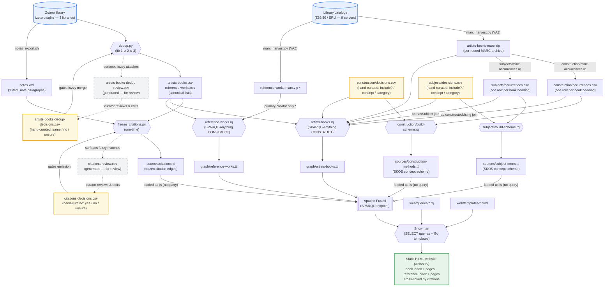

# Build pipeline

The build runs as two parallel tracks — the **artists' books** and the **reference works** that cite them — that meet at the RDF graph stage and flow into a single static website. See [`README.md`](../README.md) for prose and [`CLAUDE.md`](../CLAUDE.md) for operational detail.

Four **hand-owned `*-decisions.csv`** files (drawn in amber) are the human
curation points: a person's calls are read back by the pipeline but never
regenerated by `make`, so a re-run can't clobber them.

`*` `reference-works-marc.zip` is harvested but only minimally consumed: the
construct query pulls just the primary creator (`100 $a`) from it, joined by
`999 $a`; the rest of the reference graph comes from the CSV, and the remaining
MARC fields (OCLC/WorldCat, secondary creators, …) are still pending.

The citation edges are **frozen**, not constructed (issue #82): `dedup.py` collapses
the three Zotero libraries into the canonical `artists-books.csv` /
`reference-works.csv` lists, and `freeze_citations.py` emits `sources/citations.ttl`
against the canonical URIs — both one-time Phase-0 steps, committed and loaded as-is.
The former live citation match (the `*-crosswalk.csv` fuzzy bridge feeding a
`reference-resources.rq` citation branch) has been removed from the repo.

## Human curation: the four `*-decisions.csv` overlays

Both fuzzy steps and both SKOS schemes are gated by a **hand-owned decisions
overlay** — the amber nodes above. Each is keyed to a stable identifier, edited
by a person, and **never written by `make`**, so re-running the pipeline reads
the human calls back without ever clobbering them. The two fuzzy steps also emit
a companion `*-review.csv` (grey, generated fresh each run) that surfaces the
uncertain matches a curator should look at — the dashed *curator reviews & edits*
edge closes the loop: a person reads the review CSV and records the call in the
matching `*-decisions.csv`, which the next run reads back to gate the step.

| decisions file | keyed by | gates | effect of a call |
|---|---|---|---|
| `artists-books-dedup-decisions.csv` | lib-1 key | `dedup.py`'s fuzzy merge | `same` collapses two records into one canonical node; `no`/`unsure` keeps the lib-1 record as its own node instead of merging into its twin |
| `citations-decisions.csv` | (refKey, bookKey) | `freeze_citations.py`'s emission | `yes` blesses an uncertain paragraph→work match; `no`/`unsure` suppresses the citation edge |
| `construction/decisions.csv` | heading cluster | `construction/build-scheme.rq` + the `ab:constructedUsing` join | `include=y` rows define a concept and drive the per-book links; others are dropped |
| `subjects/decisions.csv` | heading cluster | `subjects/build-scheme.rq` + the `ab:hasSubject` join | `include=y` rows define a concept and drive the per-book links; others are dropped |

The **construction-methods** and **subject-terms** tracks are parallel
enrichments of the book graph, mined from the same book MARC by the same
three-role pipeline (issues #86/#103, #105); they **partition** the heading
space — construction mines genre/form (`655`), material (`340`) and non-plain
topical (`650`) headings (*how* a book is made), subjects mines plain topical
`650` and geographic `651` (*what* it is about). In each, `mine-occurrences.rq`
extracts every relevant heading to an `occurrences.csv` (one row per book
heading — a single pass over the archive, so every downstream step is a cheap
CSV-to-CSV join), and the hand-curated `decisions.csv` is the call for each
heading cluster (include? / concept id / category). `build-scheme.rq` joins the
two into the SKOS scheme (`sources/construction-methods.ttl` /
`sources/subject-terms.ttl`), and `artists-books.rq` joins the same two to
attach an `ab:constructedUsing` / `ab:hasSubject` link from each book to the
concepts its headings map to. Fuseki loads both schemes as-is alongside the
constructed graphs, so the site can resolve each linked concept's label. See
[`sources/construction/README.md`](../sources/construction/README.md) and
[`sources/subjects/README.md`](../sources/subjects/README.md) for the
mine → curate → build pipeline.
