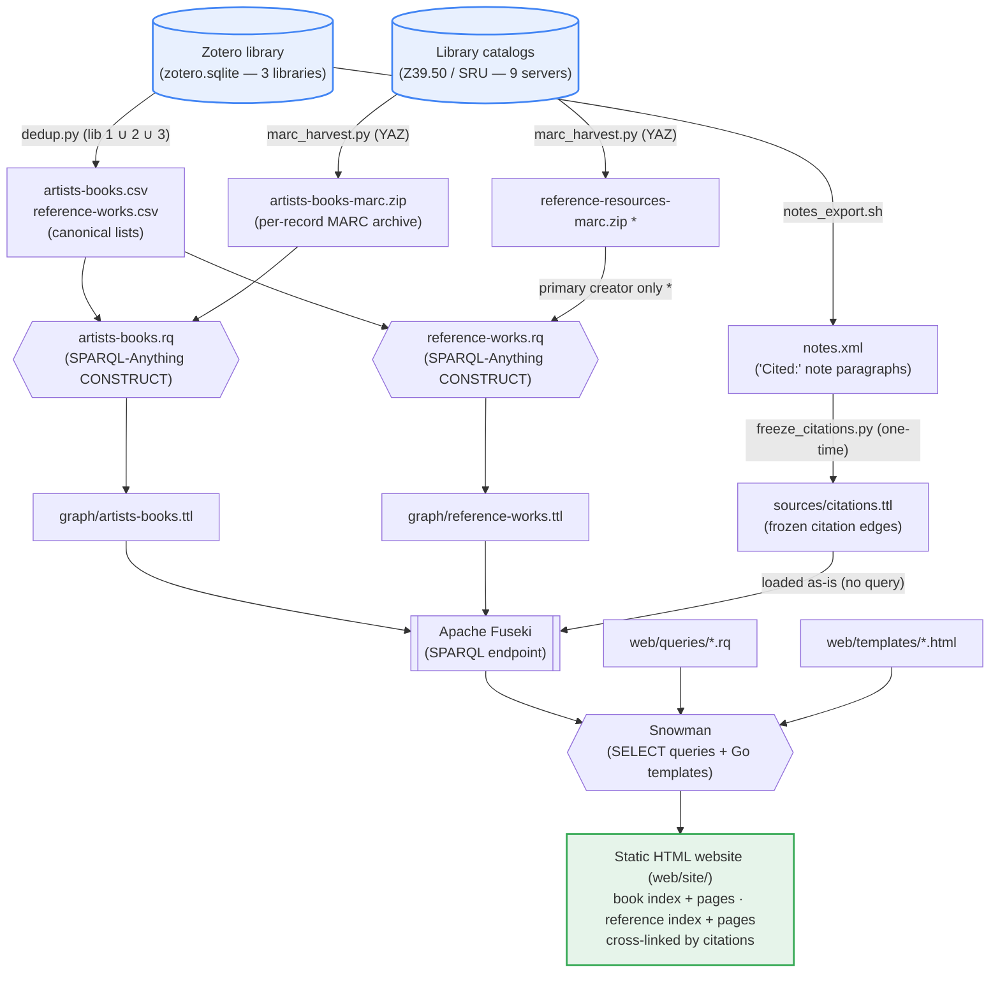

# Build pipeline

The build runs as two parallel tracks — the **artists' books** and the **reference works** that cite them — that meet at the RDF graph stage and flow into a single static website. See [`README.md`](../README.md) for prose and [`CLAUDE.md`](../CLAUDE.md) for operational detail.

`*` `reference-resources-marc.zip` is harvested but only minimally consumed: the
construct query pulls just the primary creator (`100 $a`) from it, joined by
`999 $a`; the rest of the reference graph comes from the CSV, and the remaining
MARC fields (OCLC/WorldCat, secondary creators, …) are still pending.

The citation edges are **frozen**, not constructed (issue #82): `dedup.py` collapses
the three Zotero libraries into the canonical `artists-books.csv` /
`reference-works.csv` lists, and `freeze_citations.py` emits `sources/citations.ttl`
against the canonical URIs — both one-time Phase-0 steps, committed and loaded as-is.
The former live citation match (the `*-crosswalk.csv` fuzzy bridge feeding a
`reference-resources.rq` citation branch) has left the repeatable build.
