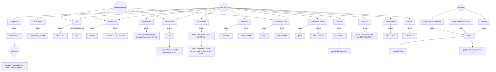

```mermaid
flowchart TD
    Z((Artist Book)) --> A[images at]
    A -->|lib cat| B[MARC 856 42]
    Z --> L[cover image]
    L -->|Jstor| M[recordname_001.tiff]
    B --> C{Jstor Link}
    C --> id1[exclude: Photos of artist book cover and interior]
    Z --> D[title]
    D -->|lib cat| E[MARC 245]
    D -->|zotero/all-items.csv| F[title]
    Z --> G[contributor]
    G -->|zotero| H[creator]
    G -->|lib cat| I[MARC 100, 110, 700, 710]
    Z --> J[creator type]
    J -->|ULAN| K[gvp:agentTypePreferred; gvp:agentTypeNonPreferred]
    Z --> N[worldcat link]
    N -->|zotero| O[URL]
    O --> id2[only results that include www.worldcat.org]
    Z --> P[construction]
    P -->|lib cat| Q[MARC 500, MARC 655, MARC 380]
    Q --> id3[check 500 notes against terms in AAT or Open Artist Book]
    Z --> R[publisher]
    R -->|zotero| S[publisher]
    R -->|lib cat| T[MARC 260 $b]
    Z --> U[publication date]
    U -->|zotero| V[date]
    U -->|lib cat| Y[MARC 260 $c]
    Z --> X[publication place]
    X -->|zotero| AA[place]
    X -->|lib cat| AB[MARC 260 $a]
    Z --> AC[subject]
    AC -->|lib cat| AD[MARC 6XX]
    AD --> id4[exclude $v specimens]
    Z --> AE[language]
    AE -->|lib cat| AF[MARC 546, MARC 008 byte 35-37, MARC 041]
    Z --> AH[related titles]
    AH -->|lib cat| AG[MARC 740]
    Z --> AI[edition]
    AI -->|lib cat| AJ[MARC 250]
    ZA((Reference Book)) --> D
    ZA --> G
    ZA --> U
    ZZ((Citation)) --> ZB[cited by]
    ZB -->|zotero| ZC[Notes]
    ZC --> id5[start with Cited:]
    ZZ --> ZD1[image number connector]
    ZD1 -->|zotero| ZC
    ZZ --> ZD2[page number connector]
    ZD2 -->|zotero| ZC
    ZC --> id6[pages with images are in bold]
    ZA --> N
```