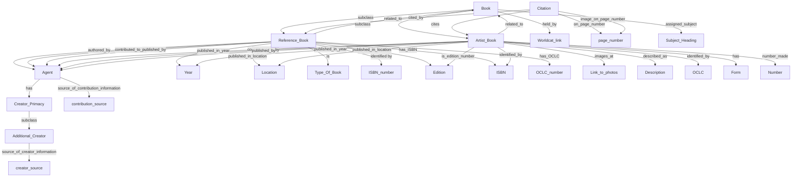

| Class | Description |
| ----- | ----------- |
|Book|Class of books.|
|Reference_book|Subclass of book that cites/talks about specific Artists' Books.|
|Artist_book|Subclass of book. Book created by an agent as a work of art.| 
|Agent|Class of things that can do things.|
|Person|Subclass of Agent. A human being.|
|Group|Subclass of Agent. A group of agents.|
|Citation| A relationship class between an Artist Book and a Reference Book.|
|Type_of_book| Class of different types of books.|
|Monograph| Subclass of Type_of_book with a single topic and single author.|
|Exhibition_catalog|Subclass of Type_of_book published to coincide with an exhibition.|
|Anthology|Subclass of Type_of_book with multiple authors. Examples are a collection of essays on a topic or a collection of talks given at a symposium.|
|Creator_Primacy|Class of the role prominence an Agent has in the creation of an Artist_book.|
|Primary_Creator|Subclass of Creator_Primacy. Credited as the primary creator of an Artist_Book in the Artist_book or in its library record.|
|Secondary_Creator|Subclass of Creator_Primacy. Creator listed in the Artist_book library record or Artist_book itself in any creator role and not listed as contributors or primary creator. Usually listed in record as Additional authors, etc.|
|Additional_Creator|Subclass of Creator_Primacy. Creator listed in an external source (not the Artist_Book or library record) as holding a specific role and not as a contributor or having contributed to.|
|Form|Class of the physical forms/features of an Artist_book.|
|Material|Subclass of Form. Materials Artist_book is made out of.|
|Technique|Subclass of Form. Techniques used in creation of an Artist_Book.|
|Dimensions|Subclass of Form. Dimensions of an Artist_book.|
|Subject_heading| Class of book subjects in library record.|

| Properties | Description |
| ----- | ----------- |
|authored_by| Relates an Agent to a Book they authored.|
|created_by| Relates an Agent to a Artist_book.|
|text_by| Subproperty of created_by. Relates an Agent to an Artist_book they created the text for.|
|book_artist| Subproperty of created_by. Relates an Agent to an Artist_book they are credited as the book artist for.| 
|contributed_to_by| Relates a Agent to a Book they contributed to.|
|related to| Relates an Artist Book to a Book that it is related to.|
|published_by| Relates an Agent to a Book they published.|
|published_in_year|Relates a Book to the Year it was published.|
|published_in_location|Relates a Book to the Location where it was published.|
|has_ISBN|Relates a book to its ISBN.|
|has_OCLC|Relates a book to its OCLC number.|
|source_of_creator_information| Relates Additional Creator linked to a Contribution to where the contribution information was found.|
|source_of_contribution|Relates an Agent to the source of information naming them as a contributor to an Artist_book if that source is not the book itself or a library record.|
|images_at|Relates an Artist_book to a source where images of the artist book are stored.|
|described_as|Relates an Artist_Book to a free text description of the Artist_Book.|
|is_edition_number|Relates Book to the number of its edition.|
|number_made|Relates an Artist_book to the number of how many were produced.|
|held_by|Relates a book to the worldcat.org link of institutions that hold it.|
|cited_by|Relates a Citation to a Reference_book.|
|cites|Relates a Citation to an Artist_book.|
|on_page_number|Relates Citation to page number where it is found.|
|image_on_page_number|Subproperty of on_page_number. Relates Citation to a page number where an image of the cited Artist_book is.|
|assigned_subject|Relates an Artist_book to a subject heading.|

